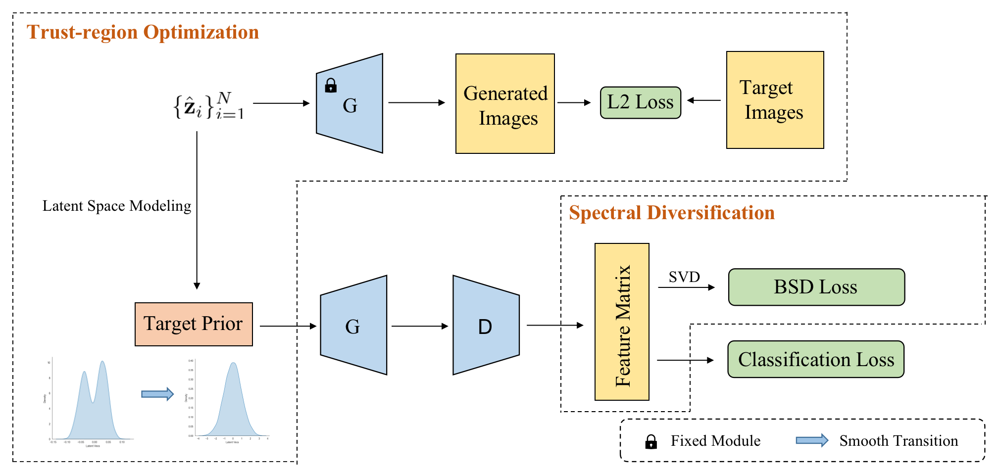

# Overcoming Catastrophic Forgetting for Fine-tuning Pre-trained GANs
  Pytorch implement of Overcoming Catastrophic Forgetting for Fine-tuning Pre-trained GANs.
  

# Requirement
  We mainly develop this project based on torch1.10.1+cu113, and you can use the following command to install environment dependencies.
  ```
  pip install -r requirements.txt
  ```


# Data Prepare
  Download Flowers, Cathedral, Pets dataset to `./data/`.

  Flowers: https://www.robots.ox.ac.uk/~vgg/data/flowers/102/

  Cathedral(subset of places205): http://places.csail.mit.edu/downloadData.html

  Pets: https://www.robots.ox.ac.uk/~vgg/data/pets/

  We select 1000, 100 and 25 samples from these datasets respectively to build new subsets, namely Flowers-1K, Flowers-100, Flowers-25, Cathedral-1K, Cathedral-100, Cathedral-25, Pets-1K, Pets-100 and Pets-25. All these subsets consist of randomly selected samples, except Flowers-25 for which we choose the first 25 passion flower images from the Flowers dataset.


# Computing Optimal Latent Vectors.
  We use optimization-based methods to find hidden vectors for each image in the target dataset. Specifically, the Vec2Img method is used to calculate the L2 loss of the generated image and the target image. Since the pre-trained GAN belongs to cGAN and contains the class embedding on the ImageNet data, we use resnet50 as the classifier to calculate the distribution of the target dataset in the pre-training category, and calculate the weighted sum of the pre-trained class embeddings as a new class embeddings for the target data.

      ```
      # First compute class embeding of the target data
      python compute_class_embedding.py --config {Path of vec2img config}
      # eg: python compute_class_embedding.py --config configs/vec2img/flowers/vec2img_flowers_sub100.yaml, result will be saved in output/flowers_sub100.

      # Then compute latent vectors of target data
      python vec2img.py {Path of vec2img config}
      # eg: python vec2img.py configs/vec2img/flowers/vec2img_flowers_sub100.yaml, result will be saved in output/vec2img/flowers_sub100
      ```

# Latent Space Modeling
 After calculating the hidden vector of the target dataset, it can be modeled using GMM as a priori distribution. The number of GMM components is set to 5 for the full, 1000 and 100-sample dataset experiments and 3 for the 25-sample dataset.
 ```
 python latentvecs_modeling.py --prefix {Root path of latentvecs} --components_num {Number of GMM components}
 # eg: python latentvecs_modeling.py --prefix output/vec2img/flowers_sub100 --components_num 5
 ```

# Finetuning
  Finally, we can fine-tuning the target dataset using our proposed methods such as trustOPT-, trustOPT, BSD, etc.

    ```
    # trustOPT-
    python train.py {Path of trustOPT- finetuning config}
    # eg: python train.py configs/finetune/flowers/finetune_flowers_sub100_trustOPT_simple.yaml

    # trustOPT
    python train.py {Path of trustOPT finetuning config}
    # eg: python train.py configs/finetune/cathedral/finetune_cathedral_trustOPT.yaml

    # BSD
    python train_bsd.py {Path of BSD finetuning config}
    # eg: python train_bsd.py configs/finetune/flowers/finetune_flowers_sub100_BSD.yaml
    
    # tensorboard visualization
    tensorborad --logdir {Path of output dir}
    ```